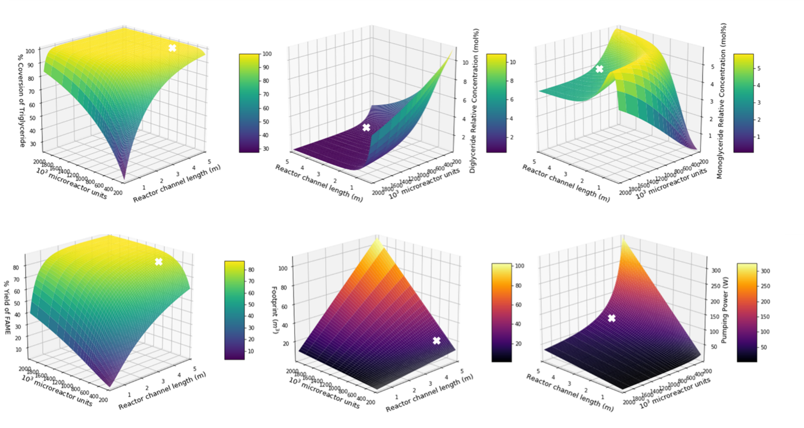

# microreactorkinetics
Modeling microreactor kinetics for robust conversion of used cooking oil into biodiesel

*Part of a chemical engineering senior project at Northeastern University. Please see the presentation file to see how this model fit into the scope of the project as a whole.*

### Motivation
These models served to map several key parameters in relation to the yield and purity of biodiesel as well as process throughput. The optimal parameters would then be used to inform scale-up and reactor design (microreactor channel geometry, number of microreactor chips, flow rate, etc).


*Pumping power and total reactor footprint were estimated to see how they would scale, but the actual values may not be accurate.*

Initially, the models were going to use kinetics rate constants determined experimentally by our team, but labs on campus were closed in March 2020 due to COVID-19, so these parameters were extracted from literature (see the presentation file for references). Two reactor types can be used: continuous stirred tank reactor (CSTR) and plug flow reactor (PFR), but PFRs were selected to model each microreactor channel. This framework can also be implemented to investigate the kinetics of reactor networks set up in parallel or in series.

### Running the models
`optimization_micro.py` was used to investigate the kinetics of the microreactors, while `optimization_bulk.py` was used to compare the performance of microreactors with that of a bulk-scale reactor. Both scripts are dependent on the input files located in the `in_files` directory, so the respective target directories for reading/writing will need to be edited.

Required packages:
```
numpy
pandas
```
Scripts output graphs and a .csv file.
